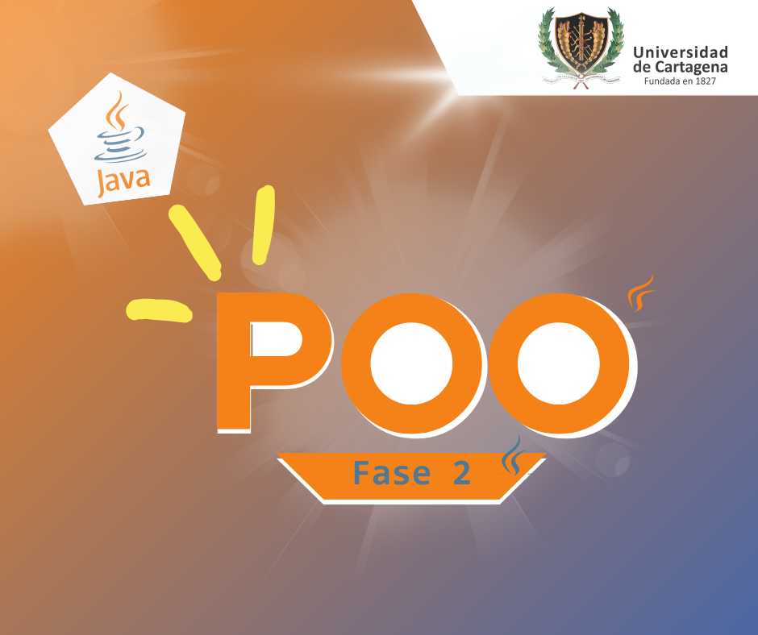

# Ejercicio28_Lavadero
# *Menú*
- [Caracteristicas principales](https://github.com/GomezRKevinM/Lavadero?tab=readme-ov-file#descripci%C3%B3n)
- [Estructura del proyecto](https://github.com/GomezRKevinM/Lavadero?tab=readme-ov-file#estructura-del-proyecto)
- [Requisitos funcionales principales](https://github.com/GomezRKevinM/Lavadero?tab=readme-ov-file#requisitos-funcionales-principales)
- [Dependencias](https://github.com/GomezRKevinM/Lavadero?tab=readme-ov-file#dependencias)
- [Fase 2](https://github.com/GomezRKevinM/Lavadero?tab=readme-ov-file#fase-2)
## Descripción

**Ejercicio28_Lavadero** es un sistema de gestión para una compáñia con multiples mini empresas entre ellas el servicio de lavadero de automóviles, desarrollado como ejercicio académico para la asignatura de Ingeniería del Software. El sistema permite administrar clientes, empleados, vehículos, productos, servicios, proveedores, bodegas, áreas de trabajo, contratos y documentos comerciales, facilitando la operación integral de un lavadero.

## Características principales

- **Gestión de clientes y vehículos:** Registro, edición, búsqueda y eliminación de clientes y sus vehículos.
- **Gestión de empleados y contratos:** Creación, edición y eliminación de empleados, asignación de contratos y cargos.
- **Catálogo de productos y servicios:** Organización de productos y servicios en categorías, con información detallada y control de stock.
- **Gestión de bodegas:** Administración de bodegas y productos almacenados.
- **Gestión de proveedores:** Registro de proveedores, información de pago y productos suministrados.
- **Documentos comerciales:** Generación y manejo de cotizaciones, pedidos, notas de corrección, comprobantes de pago y órdenes de venta.
- **Control de áreas de trabajo y cubículos:** Organización de áreas y cubículos para la prestación de servicios.
- **Consultas y reportes:** Listados y búsquedas de clientes, empleados, productos, servicios, proveedores, documentos y más.
- **Persistencia de datos:** Almacenamiento de la información en archivos JSON.

## Estructura del proyecto

- `src/main/java/co/edu/udc/ejercicio28_lavadero/modelo/entidades/`: Clases de entidades del dominio (Empresa, Cliente, Empleado, Producto, Servicio, etc.).
- `src/main/java/co/edu/udc/ejercicio28_lavadero/Principal.java`: Clase principal con los menús y la lógica de interacción.
- `DB/Empresas/`: Carpeta donde se almacenan los archivos JSON de cada empresa.
- `Diagramas/`: Diagramas UML del sistema.
- `README.md`: Este archivo de documentación.

## Requisitos funcionales principales

- Registrar y gestionar clientes, empleados, vehículos, productos, servicios, proveedores y bodegas.
- Generar y consultar documentos comerciales (cotizaciones, pedidos, notas de corrección, comprobantes de pago, órdenes de venta).
- Consultar el catálogo de productos y servicios, categorías, stock y productos por agotarse.
- Gestionar la cola de vehículos y la asignación de servicios a empleados y cubículos.
- Consultar y reportar información relevante para la operación del lavadero.


## Dependencias

- [Gson](https://github.com/google/gson): Para la serialización y deserialización de objetos a JSON.
- *SQLite*: Para el manejo y la persistencia de datos.
---
### Fase 2

### Implementación de CRUDL

- **Funciones**
    - [Agregar](https://github.com/GomezRKevinM/Lavadero?tab=readme-ov-file#agregar-)
    - [Buscar](https://github.com/GomezRKevinM/Lavadero?tab=readme-ov-file#buscar-)
    - [Editar](https://github.com/GomezRKevinM/Lavadero?tab=readme-ov-file#editar-%EF%B8%8F)
    - [Eliminar](https://github.com/GomezRKevinM/Lavadero?tab=readme-ov-file#eliminar)
    - [Listar Todo](https://github.com/GomezRKevinM/Lavadero?tab=readme-ov-file#listar-todo-)
    - [Contar](https://github.com/GomezRKevinM/Lavadero?tab=readme-ov-file#contar-)


- **Base de datos ** 

    Para el desarrollo de esta fase se empleó `SQLite` para el manejo
    y persistencia de datos.

    - Consultar datos
    - Insertar datos
    - Actualizar datos
    - Eliminar datos
---


## Agregar ➕
`agregar(C Object)`\
En Agregar obtenemos un objeto o instancia como parametro/argumento,
este objeto es validado en sql para confirmar su registro o existencia.
Sí el registro existe, entonces no se agrega y sino, entonces será registrado en la base de datos. \
**Clase empleada** [](https://github.com/GomezRKevinM/Lavadero?tab=readme-ov-file#update-data)

<details>
<summary>👉 ver Ejemplos</summary>

### Bodega

```java
public void agregar(Bodega b){
    InsertData.Bodega(b.getNombre(),b.getUbicacion());
}
```
Exactamente igual con todas las clases, solo cambia el método de insertar para adaptarse a los atributos que deben ser almacenados en la base de datos.

### Área de Trabajo
```java
public static void agregar(AreaDeTrabajo area){
    InsertData.AreaDeTrabajo(area.getNombreAreaDeTrabajo(),area.getDescripcion());
}
```

### Catalogo
```java
public void agregar(Catalogo catalogo) throws Exception {
  InsertData.Catalogo(catalogo.getIdCatalogo());
}
```

### Categoria
```java
public void agregar(Catalogo catalogo) throws Exception {
  InsertData.Catalogo(catalogo.getIdCatalogo());
}
```

### Cliente
```java
public void agregar(Cliente cliente) throws Exception {
  InsertData.Cliente(cliente.getNombre(),cliente.getTipoID().name(), cliente.getIdentificacion(), cliente.getCorreo(),cliente.getTelefono(),cliente.getDireccion());
}
```

etc..
</details>

---

## Buscar 🔎
`buscar(String id)`\
Buscar inicialmente trabajaba con la función `listarTodo()`, sin embargo se incorporó otro método de consulta individual
en la clase `ConsultarData` y esta retorna una instancia en específico al buscarlo en la base de dato por él `codigo`,`id` o `identificacion` \
**Clase usada:** [](https://github.com/GomezRKevinM/Lavadero?tab=readme-ov-file#insert-data)

<details>

<summary>👉 ver ejemplos</summary>

### Cliente  

```java
public Cliente buscar(String identificacion) throws Exception {
  try{
    return ConsultarData.Cliente(identificacion);
  }catch (Exception e){
    throw new Exception(e.getMessage());
  }
}
```

### Bodega -cyan?logo=c&logoColor=cyan&labelColor=black&)

```java
public void agregar(Catalogo catalogo) throws Exception {
  InsertData.Catalogo(catalogo.getIdCatalogo());
}
```

</details>

Se pueden usar ambos casos en cualquiera de las clases crudl.

---

## Editar ✍️
`editar(C Object)` \
  Para editar se valida que el registro del objeto no exista en la tabla, sí existe retorna un error y si no existe nos permite actualizar los datos de dicho registro. \
  **Clase empleada:** [](https://github.com/GomezRKevinM/Lavadero?tab=readme-ov-file#update-data)

<details>
  <summary>👉 ver ejemplos</summary>

### CategoriaCrudl
```java
    public void editar(Categoria categoria) throws Exception {
        Categoria categoriaEditar = ConsultarData.Categoria(categoria.getCodigo());

        Scanner input = new Scanner(System.in);
        System.out.println("Editar categoria: ");
        System.out.println("1) Nombre: "+categoriaEditar.getNombre());
        System.out.println("2) Icono: "+categoriaEditar.getIcono());
        String opcion = input.nextLine();
        switch (opcion){
            case "1":
                System.out.println("Nuevo nombre: ");
                String nuevoNombre = input.nextLine();
                if(nuevoNombre.equalsIgnoreCase(categoriaEditar.getNombre())){
                    throw new Exception("El nombre no puede ser igual al anterior");
                }
                UpdateData.Categoria("nombre",categoriaEditar.getNombre(),Integer.parseInt(categoriaEditar.getCodigo()));
                break;
            case "2":
                System.out.println("Nuevo icono: ");
                String nuevoIcono = input.nextLine();
                if(nuevoIcono.equalsIgnoreCase(categoriaEditar.getIcono())){
                    throw new Exception("El icono no puede ser igual al anterior");
                }
                UpdateData.Categoria("icono",categoriaEditar.getIcono(),Integer.parseInt(categoriaEditar.getCodigo()));
                break;
            default:
                System.out.println("Opción "+opcion+" no existe");
                editar(categoria);
                break;
        }
    }
```

### EmpresaCrudl

```java
   public void editar(Empresa empresa) throws Exception {
        Scanner input = new Scanner(System.in);
        System.out.println("Editar Empresa: " + empresa.getNombre());
        System.out.println("1) cambiar nombre");
        System.out.println("2) cambiar catalogo");
        System.out.println("3) cambiar informacion de pago");
        String opcion = input.nextLine();
        switch (opcion) {
            case "1":
                System.out.println("Nuevo nombre: ");
                String nombre = input.nextLine();
                UpdateData.Empresa("nombre",nombre,Integer.parseInt(empresa.getCodigo()));
                break;
            case "2":
                System.out.println("Nuevo catalogo: ");
                for(Catalogo cat : ConsultarData.catalogos()){
                    System.out.println(Integer.parseInt(cat.getIdCatalogo())+1+") nombre: "+cat.getNombre());
                }
                System.out.print("Seleccione una opcion: ");
                String catalogo = input.nextLine();
                UpdateData.Empresa("catalogo",catalogo,Integer.parseInt(empresa.getCodigo()));
                break;
            case "3":
                System.out.println("Nuevo informacion de pago: ");
                for(InformacionPago info: ConsultarData.InformacionDePagos()){
                    System.out.println(info.getId()+1+") cuentas bancarias: "+info.getCuentas().size());
                }
                System.out.print("Seleccione una opcion: ");
                String informacionPago = input.nextLine();
                UpdateData.Empresa("informacionPago",informacionPago,Integer.parseInt(empresa.getCodigo()));
                break;
            default:
                throw new Exception("Opcion no valida");
        }
    }
```
</details>
---

## Eliminar ⛓️‍💥
  `Eliminar` valida que la instancia del objeto exista, si esta existe entonces será eliminada, de lo contrario retornará un error. \
  **Clase empleada** [](https://github.com/GomezRKevinM/Lavadero?tab=readme-ov-file#update-data)

<details>
<summary>👉 ver ejemplos</summary>

### Contrato
```java
  public void eliminar(String codigo) throws Exception {
      DeleteData.DeleteTable("Contratos","id",Integer.parseInt(codigo));
  }
```

### Empleado
```java
  public void eliminar(int codigo){
    DeleteData.DeleteTable("Empleados","id",codigo);
  }
```

</details>
---

## Listar todo 🗂️

   
El método `listarTodo()` nos permite recuperar un `ArrayList<>` que contiene todos los registros existentes de la clase. \
**Clase empleada** [](https://github.com/GomezRKevinM/Lavadero?tab=readme-ov-file#consultar-data)

<details>
  <summary>👉 ver ejemplos</summary>

### Proveedor
```java
    public ArrayList<Provedor> listarTodo() throws Exception {
        return ConsultarData.Provedores();
    }
```

### Pedido
```java
  public ArrayList<Pedido> listarTodo() {
      return ConsultarData.Pedidos();
  }
```

</details>

---

## Contar 🔢
  El método `contar()` usa el método `listarTodo()` de la clase Crudl, para recibir un `ArrayList` de todas las existencias o registros guardados de la clase, y sacar el total de ellos empleando el método `.size()`

<details>
  <summary>👉 ver ejemplos</summary>

## Producto
````java
    public Integer contar() {
       return ConsultarData.Productos().size();
    }
````

## Detalles Pedido
````java
    public ArrayList<DetallePedido> listarTodo(String codigoPedido){
        return ConsultarData.DetallesPedido(codigoPedido);
    }
````
</details>
---

## Metodos DB 🗃️

  * Conexión
  * Consultar Datos
  * Insertar Datos
  * Actualizar Datos
  * Eliminar Datos

### Conexión 🧩

  Guardamos la conexión en una clase llamada `DatabaseConexion`,
  Cada vez que necesitemos establecer una conexión a la base de datos, podremos obtenerla desde este método.
  
  ```java
  package co.edu.udc.ejercicio28_lavadero.util;

import java.sql.Connection;
import java.sql.DriverManager;
import java.sql.SQLException;

public class DatabaseConexion {

    private static final String URL = "jdbc:sqlite:lavadero.db"; // guardamos la url de la base de datos
  
    public static Connection getConnection() throws SQLException{ // creamos el metodo para obtener la conexión
      return DriverManager.getConnection(URL); // retornamos la conexión
    }
}
  ```

## Consultar Datos 🔎

  Para realizar consultas empleamos la clase `ConsultarData`, En ella tenemos multiples métodos que nos retornan los datos consultados.
  
  ### ConsultarData
  <details>
    <summary> ver ejemplo </summary>

  ### metodo principal
  En el método principal tenemos un ejemplo de como relizar una consulta y obtener multiples datos.
```java
public static void main(String[] args) {
  String sql = "SELECT * FROM usuarios";

  // usamos la conexión dentro de try para evitar que la petición continue ejecutandose una vez que ya tenemos los resultados.
  try(Connection conn = DatabaseConexion.getConnection(); // Establecemos la conexión 
      PreparedStatement pstmt = conn.prepareStatement(sql); // preparamos la sentencia SQL
      ResultSet rs = pstmt.executeQuery()){ // ejecutamos la sentencia y guardamos los resultados

    while (rs.next()){ // recorremos cada fila empleando el método .next()
      System.out.println(Color.CYAN_BOLD+"ID: "+Color.BLANCO_BOLD+rs.getInt("id")+Color.CYAN_BOLD+" Nombre: "+Color.BLANCO_BOLD+rs.getString("nombre")+Color.CYAN_BOLD+" Email: "+Color.BLANCO_BOLD+rs.getString("email")); // imprimimos los valores de cada campo de la fila
    }
  }catch (SQLException e){ // en el catch manejamos los errores
    System.out.println(Color.ROJO_BLINK+"Error al consultar datos: "+e.getMessage());
  }
}
```

  ### Productos x Bodega
  En este método obtenemos todos los productos de una bodega.
  y en lugar de imprimir la información, hacemos uso del metodo Producto(String codigo);
  para obtener el producto que tenemos guardado en bodega.

```java
    public static ArrayList<Producto> productosBodega(String idBodega){
        String sql = "SELECT * FROM productos_bodega WHERE bodega = ?";

        try(Connection conn = DatabaseConexion.getConnection();
            PreparedStatement pstmt = conn.prepareStatement(sql);){
            pstmt.setString(1,idBodega);
            ResultSet rs = pstmt.executeQuery();
            ArrayList<Producto> listaProductos = new ArrayList<>();
            while (rs.next()){
                Producto nuevo = Producto(rs.getString("producto"));
                listaProductos.add(nuevo);
            }
            return listaProductos;

        }catch (SQLException e){
            System.out.println("Error al Seleccionar productos: "+e.getMessage());
        }
        throw new RuntimeException("Error al Seleccionar productos");
    }
```

  ### Producto(String codigo)

```java
    public static Producto Producto(String codigo){
        String sql = "SELECT * FROM Productos WHERE codigo = ?";

        try(Connection conn = DatabaseConexion.getConnection();
            PreparedStatement pstmt = conn.prepareStatement(sql)){
            pstmt.setString(1,codigo);
            ResultSet rs = pstmt.executeQuery();
            if(rs.next()){
                return new Producto(rs.getString("nombre_producto"),rs.getString("marca"),rs.getInt("categoria"),rs.getString("codigo"),rs.getDouble("precio"), rs.getDouble("precio_de_compra"),rs.getInt("stock"),rs.getInt("alerta"),rs.getInt("codigo_provedor"));
            }else{
                throw new RuntimeException("No se encontro producto con codigo: "+codigo);
            }
        }catch (SQLException e){
            System.out.println("Error al Seleccionar producto: "+e.getMessage());
        }
        throw new RuntimeException("Error al Seleccionar producto");
    }
```

  </details>

## Insertar Datos ➕

  Para insertar registros en nuestra base de datos empleamos a la clase `InsertData`,En ella tenemos multiples métodos que nos permiten insertar los registros correspondientes para cada tabla.

### InsertData

  <details>
    <summary> ver ejemplo </summary>

 ### Método principal

  Al igual que en `ConsultarData` en `InsertData` nuestro método principal tiene un ejemplo de como realizar un insert.

```java
    public static void main(String[] args) {
        String sql = "INSERT INTO usuarios (nombre,email) VALUES (?,?)";

        try(Connection conn = DatabaseConexion.getConnection();
            PreparedStatement pstmt = conn.prepareStatement(sql)
        ){
            pstmt.setString(1, "Juan Perez");
            pstmt.setString(2, "juan@example.com");
            pstmt.executeUpdate();
            System.out.println("Datos insertados exitosamente");
        }catch(SQLException e){
            System.out.println("Error al insertar datos: "+e.getMessage());
        }
    }
```

### Categoria
En el metodo `Categoria(String name, String icon)` se solicita el nombre y la ruta de la imagen icon para insertar un nuevo registro en la tabla `Categorias`.

```java
    public static void Categoria(String name, String icon){
        String sql = "INSERT INTO categorias (nombre,icono) VALUES (?,?)";

        try(Connection conn = DatabaseConexion.getConnection();
        PreparedStatement pstmt = conn.prepareStatement(sql)){
            pstmt.setString(1, name);
            pstmt.setString(2, icon);
            pstmt.executeUpdate();
            System.out.println("Categoria insertada exitosamente");
        }catch(SQLException e){
            System.out.println("Error al insertar nueva categoria: "+e.getMessage());
        }
    }
```

  </details>

## Actualizar Datos 🔃

  Para Actualizar los registros de la base de datos usamos la clase `UpdateData`, esta clase se encarga de manejar una sentencia sql UPDATE 

  ### UpdateData
  Inicialmente contenia métodos individuales para cada tabla, sin embargo al percatarme de que esto no era necesario si hacia una función general, decidi crear 
  `UpdateData` este método a la fecha de subido este repositorio no se encuentra en uso global del proyecto, sin embargo la idea es emplear este metodo para todas las actualizaciones.

  <details>
    <summary> 👉 ver detalles </summary>

  ### Método principal
  En el metodo principal continuamos usando el ejemplo de la tabla usuarios, y le pasamos como argumento al primer ?  `Gary Castaño`, y al segundo
  1, quiere decir que al final la sentencia SQL queda tal que
```java
String sql = "UPDATE usuarios SET nombre = 'Gary Castaño' WHERE id = 1";
```

```java
    public static void main(String[] args) {
        String sql = "UPDATE usuarios SET nombre = ? WHERE id = ?";

        try(Connection conn = DatabaseConexion.getConnection();
            PreparedStatement pstmt = conn.prepareStatement(sql)){
            pstmt.setString(1,"Gary Castaño");
            pstmt.setInt(2,1);
            pstmt.executeUpdate();
            System.out.println("Datos actualizados exitosamente");
        }catch (SQLException e){
            System.out.println("Error al actualizar datos: "+e.getMessage());
        }
    }
```

  ### UpdateDate (BETA)
  
```java
    public static void UpdateData(String table, String campo, String valor,String where, String codigo){
        String sql = "UPDATE "+table+" SET "+campo+" = ? WHERE "+where+" = ?";

        try(Connection conn = DatabaseConexion.getConnection();
            PreparedStatement pstmt = conn.prepareStatement(sql)){
            pstmt.setString(1,valor);
            pstmt.setString(2,codigo);
            pstmt.executeUpdate();
            System.out.println("Datos actualizados exitosamente en la tabla "+table);
        }catch (SQLException e){
            System.out.println("Error al actualizar datos de la tabla "+table + ": "+e.getMessage());
        }
    }
```

  ### Metodo empleado para categorias
```java
    public static void Categoria(String campo, String valor, int codigo){
        String sql = "UPDATE categorias SET "+campo+" = ? WHERE codigo = ?";

        try(Connection conn = DatabaseConexion.getConnection();
            PreparedStatement pstmt = conn.prepareStatement(sql)){
            pstmt.setString(1, valor);
            pstmt.setInt(2, codigo);
            pstmt.executeUpdate();
            System.out.println("Categoria actualizada exitosamente");
        }catch (SQLException e){
            System.out.println("Error al actualizar datos: "+e.getMessage());
        }
    }
```

  </details>

---

## Eliminar Datos 🗑️

  Para eliminar registros de la base de datos usamos a la clase `DeleteData` en esta clase tenemos al igual que en `UpdateData` un método global que se encarga de eliminar registros para todas las tablas, y este fue testeado exitosamente.

  <details>
    <summary> ver codigo </summary>

```java
    public static void DeleteTable(String table,String where,int codigo){
        String sql = "DELETE FROM "+table+" WHERE "+where+" = ?";

        try(Connection conn = DatabaseConexion.getConnection();
            PreparedStatement pstmt = conn.prepareStatement(sql)){
            pstmt.setInt(1,codigo);
            pstmt.executeUpdate();
            System.out.println("Datos eliminados exitosamente en la tabla "+table);
        }catch (SQLException e){
            System.out.println("Error al eliminar datos de la tabla "+table + ": "+e.getMessage());
        }
    }
```    

  </details>

## Autor

- Kevin Manuel Gómez Rojas

## Créditos

- Proyecto desarrollado como ejercicio para la asignatura de Ingeniería del Software, bajo la tutoría de **John Carlos Arrieta.**